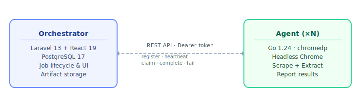

# Scraper Fleet

**Scraper Fleet** is a self-hosted, distributed web scraping platform. You define extraction templates (what data to pull from a page and how to find it) and a fleet of headless Chrome agents executes those jobs in parallel and returns structured JSON.



The **orchestrator** is a Laravel web application that handles everything: user accounts, agent registration, extraction templates, job queuing, and results. The **agent** is a standalone Go binary that polls for pending jobs, renders pages using a real browser, runs up to six extraction strategies per field, and ships the results back (including a screenshot and raw HTML for debugging).

You scale capacity by running more agents. Each one registers independently and starts picking up jobs immediately.

---

## Features

- **Template-driven extraction**: define fields once, reuse them across thousands of URLs
- **Six extraction strategies** per field, tried in order with automatic fallback:
  - CSS selectors, XPath 1.0, Schema.org (JSON-LD), Microdata, Meta tags, raw JSON-LD
- **Real browser rendering**: full JavaScript execution via headless Chrome, with support for waiting on a CSS selector before extraction starts
- **Typed results**: coerce raw text to `string`, `number`, `boolean`, or `array` with optional regex transforms
- **Horizontal scaling**: add agents with a single `docker compose up --scale agent=N`
- **Debug artifacts**: every job can store a screenshot and the raw HTML of the rendered page
- **API-first**: submit jobs and poll results programmatically with an API key, no UI required
- **Retry logic**: configurable per-job attempt limit with automatic re-queuing on failure

---

## Quick Start

The entire stack (orchestrator, database, one agent) runs with Docker Compose:

```bash
git clone https://github.com/markusheinemann/scfleet.git
cd scfleet
docker compose up --build
```

Open **http://localhost:8080** and log in with `test@example.com` / `password`.

See the [Local Setup guide](https://markusheinemann.github.io/scfleet/docs/local-setup) for configuration options, frontend HMR setup, and troubleshooting.

---

## How It Works

**1. Create a template**

Templates describe the shape of the data you want. Each field lists one or more extraction strategies. The agent tries them in order and uses the first that returns a value.

```json
{
  "version": "1",
  "js_wait_selector": "[data-loaded]",
  "fields": [
    {
      "name": "title",
      "type": "string",
      "required": true,
      "extractors": [
        { "strategy": "schema_org", "schema_type": "Product", "path": "name" },
        { "strategy": "css", "selector": "h1.product-title" },
        { "strategy": "meta", "property": "og:title" }
      ]
    },
    {
      "name": "price",
      "type": "number",
      "extractors": [
        { "strategy": "schema_org", "schema_type": "Offer", "path": "price" },
        { "strategy": "css", "selector": ".price-now" }
      ],
      "transform": { "regex": "([\\d.,]+)" }
    }
  ]
}
```

**2. Submit a scrape job**

```bash
curl -X POST https://your-orchestrator/api/v1/scrape \
  -H "Authorization: Bearer <api-key>" \
  -H "Content-Type: application/json" \
  -d '{ "url": "https://example.com/product/123", "template_id": "<template-id>" }'
```

**3. Poll for results**

```bash
curl https://your-orchestrator/api/v1/scrape/<job-id> \
  -H "Authorization: Bearer <api-key>"
```

```json
{
  "id": "01J...",
  "status": "completed",
  "result": {
    "title": "Wireless Headphones Pro",
    "price": 149.99
  }
}
```

---

## Architecture

| Component | Language / Framework | Responsibility |
|-----------|---------------------|----------------|
| Orchestrator | PHP 8.3 · Laravel 13 · React 19 | Web UI, REST API, job lifecycle, artifact storage |
| Agent | Go 1.26 · chromedp | Page rendering, data extraction, result reporting |
| Database | PostgreSQL 17 | All persistent state |

Agents authenticate with unique bearer tokens created in the orchestrator UI. External API consumers authenticate with API keys. The two token types are completely separate.

---

## Documentation

Full documentation lives at **[https://markusheinemann.github.io/scfleet/docs/](https://markusheinemann.github.io/scfleet/docs/)**:

- [Introduction](https://markusheinemann.github.io/scfleet/docs/): big picture and concepts
- [Local Setup](https://markusheinemann.github.io/scfleet/docs/local-setup): Docker Compose, HMR, troubleshooting
- [Extraction Schema](https://markusheinemann.github.io/scfleet/docs/extraction-schema): full template reference

---

## Development

```bash
# Run all services
docker compose up --build

# Run orchestrator tests
cd orchestrator && php artisan test --compact

# Run agent tests
cd agent && go test ./...

# Lint orchestrator frontend
cd orchestrator && npm run lint
```

---

## License

MIT. See [LICENSE.md](LICENSE.md).
